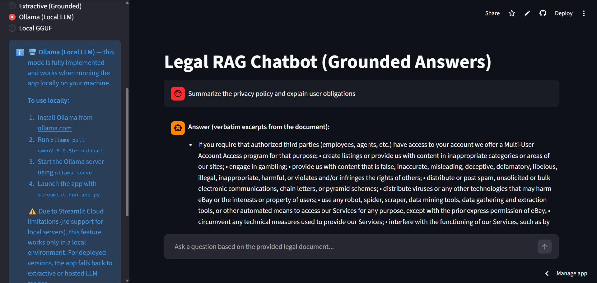
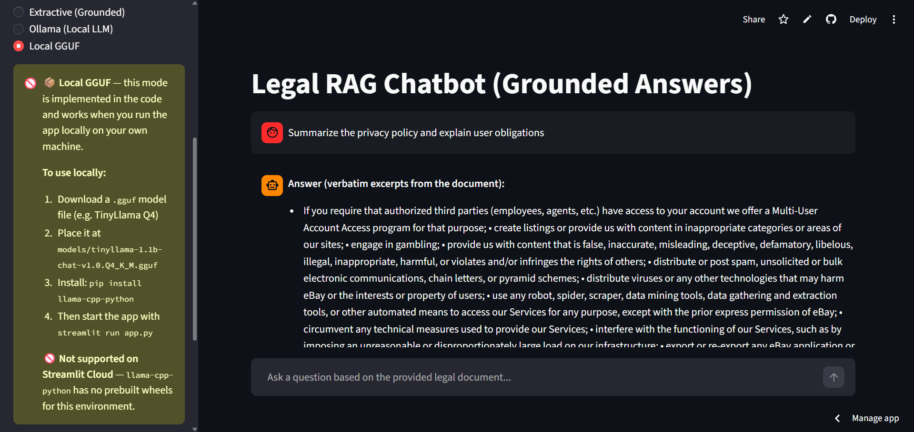

# ⚖️ Legal RAG Chatbot

A production-ready **Retrieval-Augmented Generation (RAG)** chatbot that answers questions **strictly from a provided legal document**. Built with a full semantic search pipeline, real-time streaming responses, and a clean Streamlit interface — deployable on both cloud and local machines.

<p align="center">
  <a href="Media/Recording.mp4">
    
  </a>
</p>

<p align="center">
  <a href="https://legal-ai-chatbot-hc.streamlit.app/">
    
  </a>
</p>


---
#Screenshots
<p align="center">
  <a href="">
    
  </a>
</p>
<p align="center">
  <a href="">
    
  </a>
</p>
---

## Table of Contents

- [Overview](#overview)
- [Architecture](#architecture)
- [Tech Stack](#tech-stack)
- [Features](#features)
- [Folder Structure](#folder-structure)
- [Setup — Local](#setup--local)
- [Setup — Streamlit Cloud](#setup--streamlit-cloud)
- [Answer Modes](#answer-modes)
- [Prompting & Grounding](#prompting--grounding)
- [Edge Cases Covered](#edge-cases-covered)
- [Sample Queries](#sample-queries)
- [Environment Variables](#environment-variables)
- [Logging & Observability](#logging--observability)

---

## Overview

This chatbot ingests a legal PDF document, processes it into semantically meaningful chunks, embeds them using a pre-trained sentence transformer, and stores them in a persistent FAISS vector index. At query time, relevant chunks are retrieved via cosine similarity search and injected into a strict grounded prompt sent to an LLM — either Groq (cloud), Ollama (local), or a GGUF model file.

The system **never fabricates information**. If the answer is not in the document, the bot returns:
> *"I could not find this information in the provided document."*

---

## Architecture

```
PDF Document
     │
     ▼
 scripts/ingest.py
     │
     ├── 1. Text extraction (pypdf)
     ├── 2. Cleaning — remove headers, footers, noise (src/preprocess.py)
     ├── 3. Sentence-aware chunking 100–300 words (src/chunking.py)
     ├── 4. Batch embedding generation — all-MiniLM-L6-v2 (src/embeddings.py)
     └── 5. Persistent FAISS index storage (src/vector_store.py)
                          │
                          ▼
              data/processed/
              ├── chunks.json
              └── faiss_store/

User Query
     │
     ▼
 src/rag_pipeline.py
     │
     ├── 1. Sanitize & truncate query
     ├── 2. Embed query → cosine similarity search (FAISS top-k)
     ├── 3. Relevance threshold gate (skip if score < 0.28)
     ├── 4. Build grounded prompt (src/prompting.py)
     └── 5. Stream response via Groq / Ollama / Extractive fallback
                          │
                          ▼
              Streamlit UI (app.py)
              ├── Streaming token-by-token display
              └── Source chunk expander
```

---

## Tech Stack

| Component | Technology |
|---|---|
| UI | Streamlit |
| Embeddings | `sentence-transformers/all-MiniLM-L6-v2` |
| Vector DB | FAISS (persistent, CPU) |
| LLM — Cloud | Groq API (`llama3-8b-8192`) |
| LLM — Local | Ollama (`qwen2.5:0.5b-instruct`) |
| LLM — Offline | llama-cpp-python (GGUF Q4) |
| PDF parsing | pypdf |
| Config | python-dotenv |
| Logging | Python logging + rotating file handler |

---

## Features

- **Real-time streaming responses** — token-by-token output via Groq SSE or Ollama streaming
- **Strictly grounded answers** — system prompt enforces document-only answering
- **Source chunk display** — every answer links back to the exact document passages used
- **Three answer modes** — Groq (cloud), Ollama (local), Local GGUF — switchable from the sidebar
- **Relevance threshold gating** — low-confidence retrievals return the fallback instead of guessing
- **Chat history** — last 4 messages sent as context for follow-up questions
- **Reset chat** — one-click conversation clear
- **Sidebar status** — live display of model, indexed chunks, and Groq API status
- **Graceful fallbacks** — every LLM path falls back to extractive mode if unavailable

---

## Folder Structure

```
Legal-AI-Chatbot/
│
├── app.py                   # Streamlit entrypoint
├── config.py                # Centralised settings (env vars + dataclass)
├── requirements.txt         # Python dependencies
├── .env.example             # Environment variable template
│
├── data/
│   ├── raw/                 # Place your source PDF here
│   └── processed/
│       ├── chunks.json      # Serialised text chunks
│       └── faiss_store/     # Persistent FAISS index + metadata
│
├── scripts/
│   ├── ingest.py            # PDF → chunks → embeddings → FAISS
│   └── validate.py          # Sanity-check preprocessing + retrieval
│
├── src/
│   ├── __init__.py
│   ├── preprocess.py        # Text cleaning (headers, footers, noise)
│   ├── chunking.py          # Sentence-aware 100–300 word chunking
│   ├── embeddings.py        # EmbeddingService (sentence-transformers)
│   ├── vector_store.py      # FaissVectorStore (upsert, search, count)
│   ├── prompting.py         # SYSTEM_PROMPT, build_context_block, build_user_prompt
│   ├── rag_pipeline.py      # RAGPipeline — retrieve + stream_answer
│   ├── extractive_answer.py # Fallback extractive answer builder
│   └── logging_utils.py     # Rotating log file setup
│
└── logs/
    └── app.log              # Runtime logs
```

---

## Setup — Local

### Prerequisites

- Python 3.10+ (3.11 recommended)
- pip

### 1. Clone the repository

```bash
git clone https://github.com/Harshit-Chauhan-20/Legal-AI-Chatbot.git
cd Legal-AI-Chatbot
```

### 2. Create a virtual environment

```bash
python -m venv .venv
# Windows
.venv\Scripts\activate
# macOS / Linux
source .venv/bin/activate
```

### 3. Install dependencies

```bash
pip install -r requirements.txt
```

### 4. Configure environment

```bash
cp .env.example .env
```

Edit `.env` and set your values:

```env
RAW_PDF_PATH=data/raw/AI_Training_Document.pdf
GROQ_API_KEY=your_groq_api_key_here
GROQ_MODEL=llama3-8b-8192
USE_LLM=false
DISABLE_LOCAL_GGUF=true
```

### 5. Place your PDF

Put your legal document at:

```
data/raw/AI_Training_Document.pdf
```

### 6. Ingest the document

```bash
python scripts/ingest.py
```

This creates:
- `data/processed/chunks.json` — all text chunks with metadata
- `data/processed/faiss_store/` — persistent FAISS index

Validate the pipeline (optional):

```bash
python scripts/validate.py
```

Exit code `0` = all checks passed. Exit code `2` = preprocessing OK but ingest not yet run.

### 7. Run the app

```bash
streamlit run app.py
```

Open [http://localhost:8501](http://localhost:8501) in your browser.

---

### Optional: Run with Ollama (local LLM)

```bash
# Install Ollama from https://ollama.com
ollama pull qwen2.5:0.5b-instruct
ollama serve
```

Then select **Ollama (Local LLM)** in the sidebar. No API key required.

### Optional: Run with a GGUF model

1. Download a `.gguf` file — e.g. [TinyLlama Q4](https://huggingface.co/TheBloke/TinyLlama-1.1B-Chat-v1.0-GGUF)
2. Place it at `models/tinyllama-1.1b-chat-v1.0.Q4_K_M.gguf`
3. Install the wheel:

```bash
pip install llama-cpp-python
```

4. Select **Local GGUF** in the sidebar.

---

## Setup — Streamlit Cloud

1. Fork or push this repo to your GitHub account
2. Go to [share.streamlit.io](https://share.streamlit.io) → **New app** → select your repo → set `app.py` as the entrypoint
3. In **Settings → Secrets**, add:

```toml
GROQ_API_KEY = "your_groq_api_key_here"
GROQ_MODEL = "llama3-8b-8192"
USE_LLM = "false"
DISABLE_LOCAL_GGUF = "true"
```

4. Deploy. The app will start in **Groq-powered grounded mode** automatically.

> **Note:** Ollama and Local GGUF modes are not available on Streamlit Cloud — the sidebar clearly indicates this with setup instructions for local use.

---

## Answer Modes

The sidebar lets you switch between three generation backends:

| Mode | Where it works | How it works |
|---|---|---|
| **Extractive (Grounded)** | Cloud + Local | Retrieved chunks sent to Groq (`llama3-8b-8192`) for fluent grounded answer. Falls back to pure extractive if API key missing. |
| **Ollama (Local LLM)** | Local only | Streams from a locally running Ollama server. Automatically falls back to extractive if Ollama unreachable. |
| **Local GGUF** | Local only | Runs a quantized `.gguf` model via `llama-cpp-python`. Not available on Streamlit Cloud. |

The sidebar also shows live status:
- `Groq API: ✅ Active` — key is set and LLM answers are enabled
- `Groq API: ❌ Key not set` — falling back to pure extractive

---

## Prompting & Grounding

The system prompt in `src/prompting.py` enforces:

- **Document-only answering** — the model is explicitly told it has no external knowledge
- **No fabrication** — it must refuse rather than guess
- **Conflict disclosure** — if two retrieved chunks disagree, the model must say so and cite both
- **Exact fallback string** — `"I could not find this information in the provided document."`

Retrieved chunks are injected into the prompt with their chunk IDs so the model can cite sources. The prompt caps at `LLM_MAX_CONTEXT_CHARS` (default 2800) to prevent context overflow.

---

## Edge Cases Covered

| Case | Handling |
|---|---|
| Query not in document | Fallback sentence returned |
| Partial match | Returns only available info + source IDs |
| Conflicting chunks | Model discloses conflict, cites both chunks |
| Very long query | Capped at `MAX_QUERY_CHARS` (default 2000) |
| Low retrieval score | Relevance threshold (0.28) blocks weak matches |
| Repeated / follow-up queries | Last 4 messages sent as chat history |
| Irrelevant / out-of-scope | Fallback sentence returned |
| LLM API failure | Graceful fallback to extractive mode |
| Missing FAISS index | Auto-rebuilt from `chunks.json` on first run |

---

## Sample Queries

These queries work against the provided legal/training document:

| Query | Expected behaviour |
|---|---|
| `What are the obligations of the user regarding account security?` | Grounded answer with source chunks |
| `Does the document mention termination conditions?` | Grounded answer with source chunks |
| `What dispute resolution policy is described?` | Grounded answer with source chunks |
| `What is the refund policy for sellers?` | Fallback (if not in document) |
| `Who wrote this document?` | Fallback (not retrievable) |
| `Summarise the entire document` | Partial answer from top-k chunks |

---

## Environment Variables

All variables can be set in `.env` (local) or Streamlit Secrets (cloud).

| Variable | Default | Description |
|---|---|---|
| `RAW_PDF_PATH` | `data/raw/AI_Training_Document.pdf` | Path to source PDF |
| `GROQ_API_KEY` | — | Groq API key for cloud LLM |
| `GROQ_MODEL` | `llama3-8b-8192` | Groq model name |
| `USE_LLM` | `true` | Set `false` to use Groq grounded mode |
| `DISABLE_LOCAL_GGUF` | `false` | Set `true` on Streamlit Cloud |
| `EMBEDDING_MODEL_NAME` | `sentence-transformers/all-MiniLM-L6-v2` | HuggingFace embedding model |
| `LLM_MODEL_NAME` | `qwen2.5:0.5b-instruct` | Ollama model name |
| `RETRIEVAL_TOP_K` | `6` | Number of chunks retrieved per query |
| `RELEVANCE_THRESHOLD` | `0.28` | Minimum cosine score to proceed |
| `CHUNK_MIN_WORDS` | `100` | Minimum words per chunk |
| `CHUNK_MAX_WORDS` | `300` | Maximum words per chunk |
| `MAX_QUERY_CHARS` | `2000` | Maximum query length |
| `LLM_MAX_CONTEXT_CHARS` | `2800` | Max chars injected into LLM prompt |
| `LOG_LEVEL` | `INFO` | Logging verbosity |

---

## Logging & Observability

Runtime logs are written to `logs/app.log` with rotation. Key log lines to watch:

```
INFO  - Retrieved 6 chunks
INFO  - USE_LLM disabled; using Groq grounded answer
WARNING - GROQ_API_KEY not set; falling back to extractive
WARNING - Groq failed (...); falling back to extractive
INFO  - Rebuilding FAISS from chunks.json (first run)
```

On Streamlit Cloud, view logs via **Manage app → Logs** in the bottom-right corner.

---

## Requirements

```
streamlit>=1.33.0
faiss-cpu>=1.12.0
pypdf>=4.2.0
numpy>=1.26.0
tqdm>=4.66.0
python-dotenv>=1.0.1
sentence-transformers>=2.7.0
```

> `ollama` and `llama-cpp-python` are **not** in `requirements.txt` as they cannot be installed on Streamlit Cloud. Install them manually for local GGUF/Ollama modes.

---

